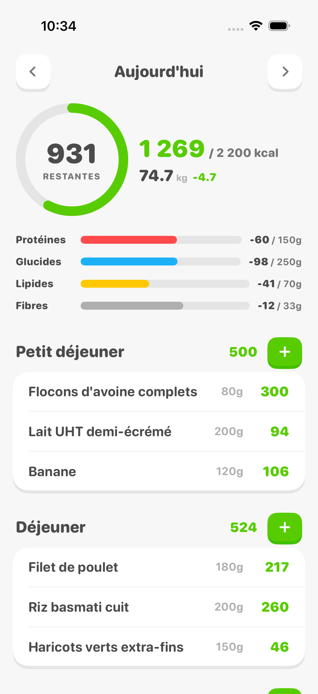
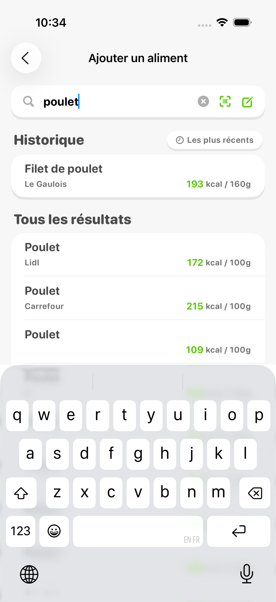
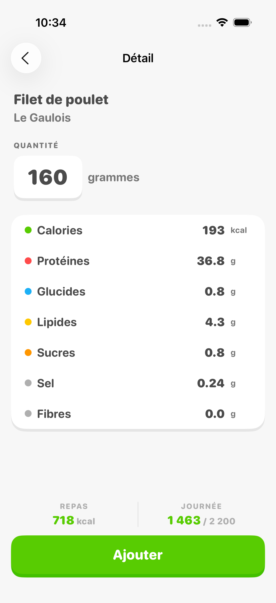
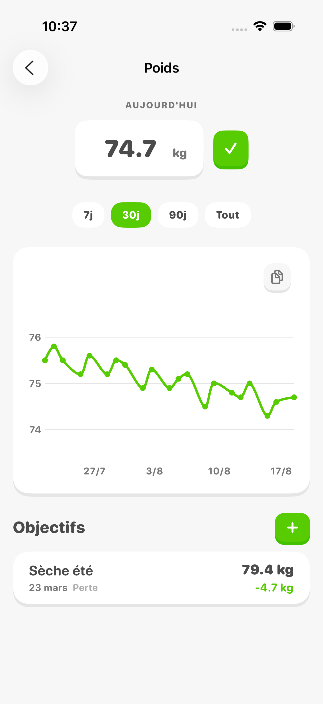
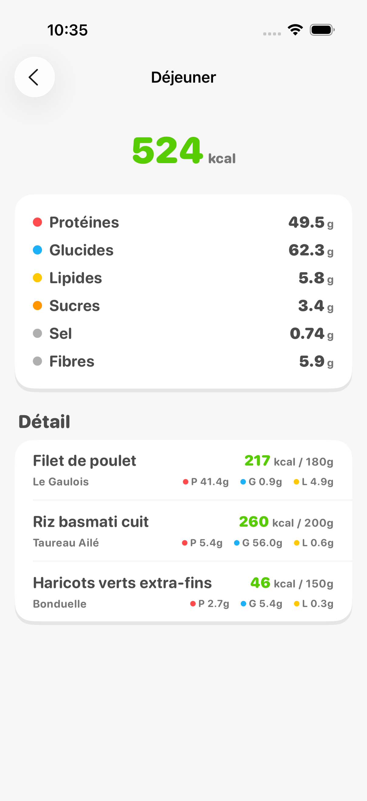
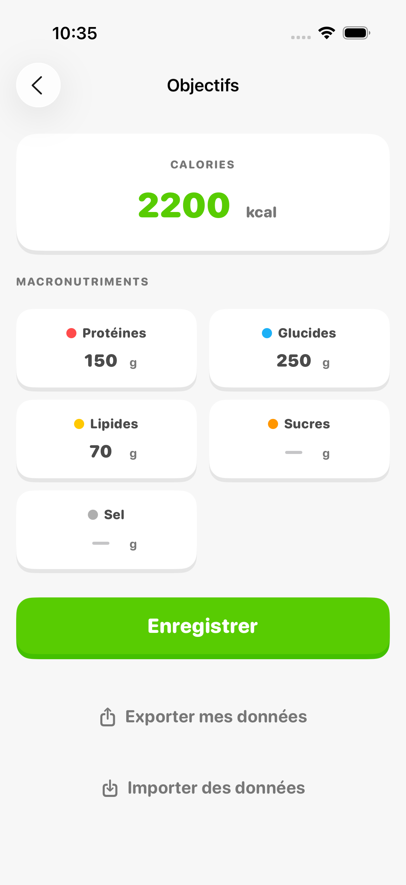

# kcalz

An iOS calorie tracker. Search 988,000 Open Food Facts products offline — no account, no server, no network.

I built it because MyFitnessPal had become unbearable. Not the features — the speed. Opening the app took several seconds, logging a meal took several more. I wanted something that opens instantly and lets me log breakfast before the coffee is done.

> **This repo is entirely vibe-coded.** I did not write a single line of it. All of it — the 4,900 lines of Swift, the Rust tools, the import scripts, the 87 commits — came out of [Claude Code](https://claude.com/claude-code). My part was describing what I wanted, running it on my phone, and saying what felt wrong.

The UI is in French only, and so is the product database.

## Screenshots

| Dashboard | Search | Product detail |
|---|---|---|
|  |  |  |

| Weight | Meal detail | Goals |
|---|---|---|
|  |  |  |

## Features

**Food log**
- Four meals a day: breakfast, lunch, snack, dinner
- Remaining-calorie ring, macro bars (protein, carbs, fat, fiber)
- Live meal and day totals while you pick a portion size
- Move between days with arrows or a calendar
- Edit or delete any logged food
- Multi-select to delete several entries at once or copy them to another meal
- One-tap copy of the previous day's meal into an empty section
- Per-meal detail screen with aggregated nutrients

**Food search**
- Full-text search over the French Open Food Facts database, bundled in the app (SQLite + FTS5)
- Ranked by relevance then popularity, 150 ms debounce, run off the main thread
- EAN barcode scanning through the camera
- History of recent and most-used foods, filterable
- Default portion pre-filled from the product's packaged quantity
- Manual entry: type grams and macros directly, no product needed
- Custom foods, created and stored locally
- Fix incomplete Open Food Facts entries: your values override the bundled database

**Weight**
- Log today's weight straight from the dashboard
- Trend chart over 7, 30, 90 days or all time, Catmull-Rom smoothed
- Weight goals (loss, gain, maintain) with the delta shown on the dashboard

**Goals and data**
- Daily targets for calories, protein, carbs, fat, sugar, salt
- Fiber target derived automatically (15 g per 1,000 kcal)
- Manual export and import of the database, with a reminder when the last export is over 7 days old

## Stack

- **SwiftUI**, Swift 6 with strict concurrency, iOS 17+
- **[GRDB](https://github.com/groue/GRDB.swift)** over two SQLite databases: Open Food Facts read-only, user data read-write
- **FTS5** for full-text search, `unicode61` tokenizer with diacritics stripped
- **Swift Charts** for the weight curve, **AVFoundation** for barcode scanning
- **[XcodeGen](https://github.com/yonaskolb/XcodeGen)** — the Xcode project is generated from `project.yml`
- Two **Rust** tools to build the product database
- No network calls, no account, no telemetry. Everything stays on the device.

The visual theme borrows from Duolingo: saturated colors, rounded corners, heavy rounded type, spring animations.

## Building the Open Food Facts database

The app bundles a 988,000-product SQLite file. It is not versioned — it weighs 230 MB. Build it in two steps.

1. Download the Open Food Facts JSONL dump:

```bash
curl -o data/openfoodfacts-products.jsonl.gz \
  https://static.openfoodfacts.org/data/openfoodfacts-products.jsonl.gz
gunzip data/openfoodfacts-products.jsonl.gz
```

2. Reduce it to French products, then convert it to SQLite:

```bash
cargo run --release --manifest-path tools/off-reduce/Cargo.toml -- \
  data/openfoodfacts-products.jsonl data/off_fr.jsonl

cargo run --release --manifest-path tools/off-to-sqlite/Cargo.toml -- \
  data/off_fr.jsonl data/off_fr.sqlite
```

`off-reduce` keeps products sold in France and drops every field the app does not read. `off-to-sqlite` builds the table and its FTS5 index.

The build also expects `data/user.sqlite`, the seed user database. An empty file works: the app copies it into Application Support on first launch and never touches it again.

## Build

```bash
brew install xcodegen
xcodegen generate

xcodebuild -scheme kcalz -project kcalz.xcodeproj \
  -destination 'platform=iOS Simulator,name=iPhone 16 Pro' build
```

To install on a device, swap the destination for your device id (`xcrun xctrace list devices`), add `-allowProvisioningUpdates`, then:

```bash
xcrun devicectl device install app --device <DEVICE_ID> <path>/kcalz.app
```

Set your own `DEVELOPMENT_TEAM` in `project.yml` before signing.

## Layout

```
kcalz/
  App/          entry point, store bootstrap
  Models/       data types
  Stores/       OFFStore (read-only), UserStore (read-write)
  ViewModels/   @Observable
  Views/        one view per screen, shared components
  Utils/        theme, date formatting
tools/
  off-reduce/     Rust — OFF dump → filtered JSONL
  off-to-sqlite/  Rust — JSONL → SQLite + FTS5
  mfp-import/     TypeScript — import a MyFitnessPal export
docs/
  SPECS.md      original spec
  plans/        one design document per feature
```

`docs/plans/` tracks the design feature by feature. It is the most readable trace of how the app was built.

## Known limits

- French only, both the UI and the product data
- No iCloud sync — backups go through the manual export
- Multi-select opens from a context menu rather than a direct long press (SwiftUI gesture conflict with the scroll view)
- No automated tests

## License

MIT. Product data comes from [Open Food Facts](https://world.openfoodfacts.org), under the [ODbL](https://opendatacommons.org/licenses/odbl/) license.
